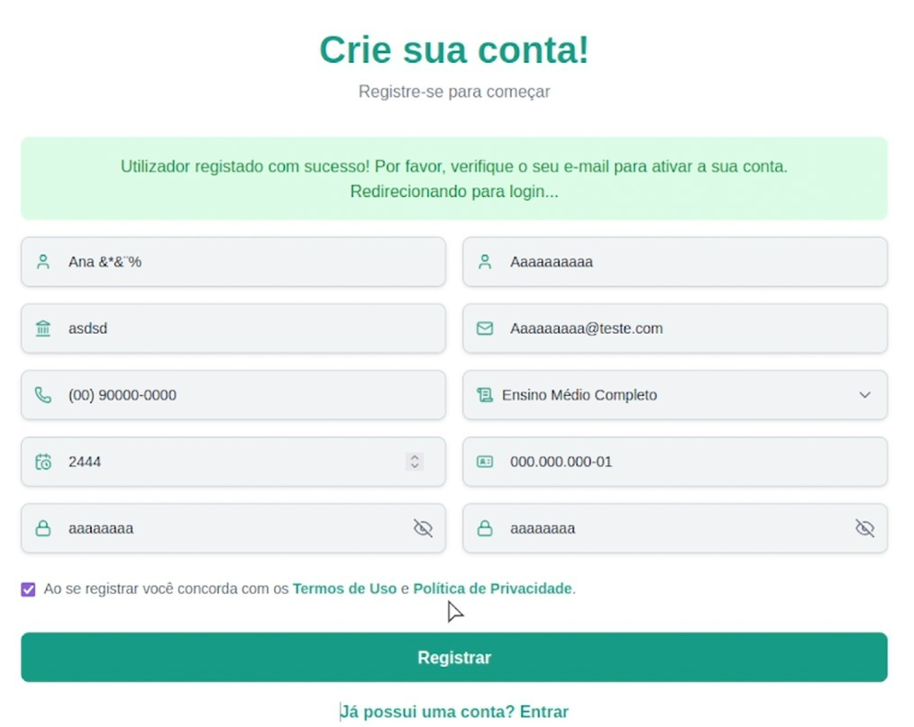
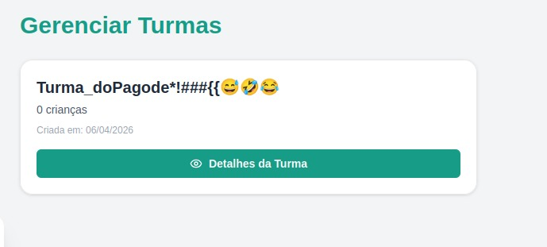
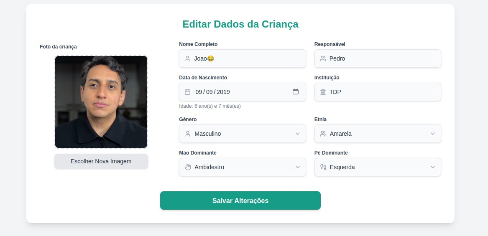

# Relatório de Testes - 07/04/2026

## Bugs Encontrados

### 1. Formulário de Cadastro (Registro de Usuário)

* **Permissão de Caracteres Especiais no Nome:** O campo de nome aceita símbolos e caracteres especiais sem validação (exemplo: "Ana &*$%").
* **Instituição Inconsistente:** O campo aceita sequências de texto sem sentido ou aleatórias (exemplo: "asdsd").
* **Máscara de Telefone Inválida:** O sistema permite o registro com números de telefone em formatos nulos ou inválidos (exemplo: "(00) 90000-0000").
* **Valores Numéricos Irreais:** Campos de data ou tempo permitem a inserção de valores fora da lógica temporal (exemplo: "2444").
* **Aceitação de E-mails Inexistentes:** O sistema valida cadastros com domínios de e-mail fictícios (exemplo: "@teste.com").
* **Ausência de Requisitos de Senha:** O sistema permite a criação de contas com senhas extremamente fracas e repetitivas (exemplo: "aaaaaaaa").

### 2. Gerenciamento de Turmas

* **Inserção de Símbolos e Emojis:** O nome da turma aceita caracteres especiais e emojis, o que pode causar erros de renderização ou quebra de layout.

### 3. Dados do Aluno e Perfil

* **Nomes com Emojis:** O campo de nome do aluno aceita a inclusão de emojis, ferindo as regras de padronização de dados nominais.
* **Erro de Upload de Arquivo Incompatível:** Ao tentar subir um arquivo de script (Python) no campo destinado à foto de perfil, o sistema apresenta um erro inesperado em vez de uma mensagem tratada.

**Vídeo de Evidência (Upload Incompatível):** [Link para o vídeo](./pythonphoto.mkv)

---

## Relatório Final e Recomendações

A bateria de testes evidenciou vulnerabilidades críticas no que diz respeito à validação de entrada de dados (input validation). A falta de restrições em campos de texto permite a inserção de dados inconsistentes, comprometendo a integridade do banco de dados.

**Recomendações Técnicas:**
* Implementar máscaras de entrada rigorosas para telefones e e-mails.
* Estabelecer uma política de complexidade de senhas.
* Aplicar filtros de sanitização para impedir o uso de símbolos e emojis em campos de nomes.
* Configurar um manipulador de exceções para uploads de arquivos, restringindo as extensões apenas para formatos de imagem (JPG, PNG).